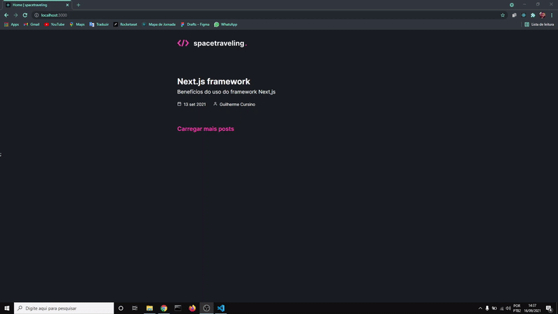
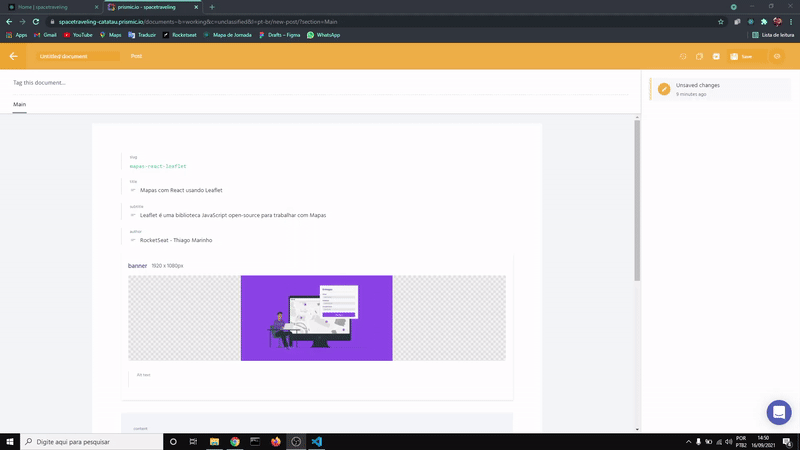
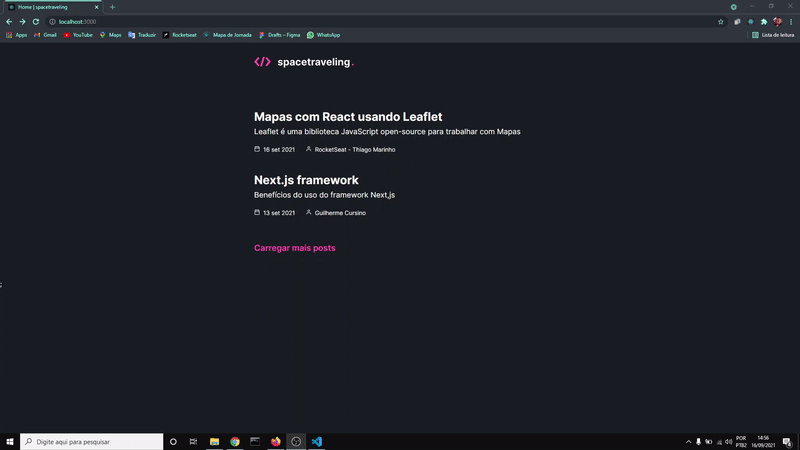

# Spacetraveling

A aplicação "spacetraveling" foi desenvolvida com parceria da ***RocketSeat*** utilizando o framework **Next.js**, adotando a estratégia de renderização em "SSG" para obter maior performnace.
Consiste em uma página no estilo blog, listando posts que são consumidos do **Prismic CMS**.

## Importante

A grande vantagem de utilizar **SSG** no **Next.js** é que a página ja é gerada de forma estática no momento do build da aplicação, assim quando acessada a página já está pronta pra ser exibida no browser.

O benefício de adotar esta estratégia é que a página por ja estar com o seu "core" pronto, ela é indexada em primeiras colocações por motores de busca como **Google**, **Bing**, etc ...

Então páginas construídas desta forma, possuem grande performance, em outras palavras, carregam mais rápido pelo browser e aparecem primeiro em buscas, tornando sua visibilidade maior.

Um exemplo prático disto seria um ***e-commerce***, a página do **Magazine Luiza** utiliza **Next** com **SSG**, automaticamente se a visibilidade é maior, os acessos também são maiores e conversão dos acessos em vendas cresce exponencialmente.

## Tecnologias utilizadas

  - React
  - Next.js
  - Prismic CMS
  - Typescript
  - SASS ( CSS )
  - Date-fns

## Aplicação

No primeiro gif, a página ja consiste em dois posts consumidos pela **API** do **Prismic**, porém com um botão **Carregar mais posts** para carregar o conteúdo conforme o desejo do usuário.

Ao carregar o conteúdo com todos os posts, o botão deixa de ser renderizado para evitar chamadas desnecessárias a **API**.

  

## Criando novo post no Prismic

Ao criar um novo post no **Prismic**, a aplicação consome este post através da **API**. Tornando-a muito mais prática quando necessitar de novos conteúdos.

  

## Novo "post" renderizado

  

